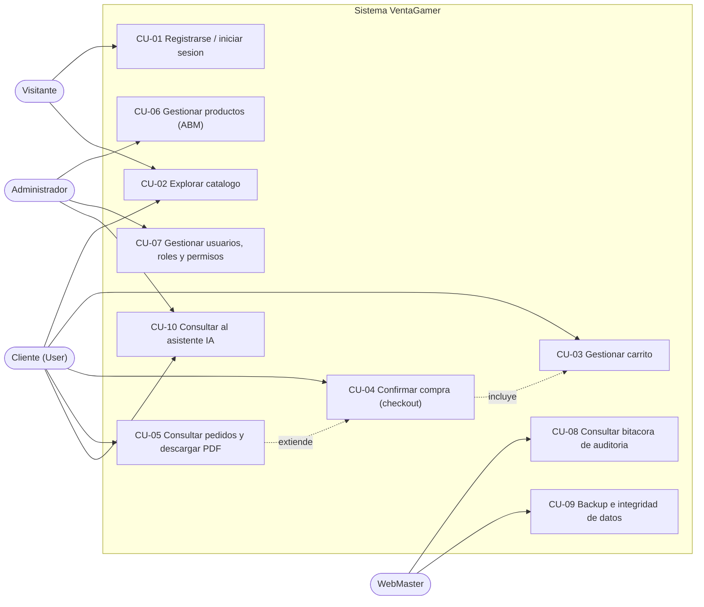

# 3. Casos de uso

[← Volver al índice](README.md)

Este documento describe los casos de uso principales de VentaGamer. Cada uno se presenta con formato completo: actores, objetivo, precondiciones, postcondiciones, escenario principal y escenarios alternativos o de excepción.

## 3.1. Diagrama general de casos de uso

> El asistente IA (CU-10) se describe en detalle en el documento [09 — Chatbot con IA](09-chatbot-ia.md); aquí se incluye su ficha resumida.

---

## CU-01 — Registrarse e iniciar sesión

| Campo | Detalle |
|---|---|
| **Actores** | Visitante |
| **Objetivo** | Obtener una cuenta y una sesión autenticada que habilite las operaciones protegidas del sistema. |
| **Precondiciones** | El visitante no posee sesión activa. Para el registro, el nombre de usuario elegido no debe existir. |
| **Postcondiciones** | El usuario queda registrado (si corresponde) y autenticado: el navegador almacena un token JWT válido por 60 minutos con sus permisos. |
| **Prioridad** | Alta — habilita el resto de los casos de uso. |

**Escenario principal (inicio de sesión):**

1. El visitante accede a la pantalla de inicio de sesión (`/login`).
2. Ingresa nombre de usuario y contraseña, y envía el formulario.
3. El sistema valida las credenciales contra el hash PBKDF2 almacenado.
4. El sistema calcula los permisos efectivos del rol del usuario (incluyendo los heredados por jerarquía de roles).
5. El sistema emite un token JWT con los datos y permisos del usuario, y registra la fecha del acceso.
6. El navegador guarda el token y redirige al catálogo. El menú se adapta a los permisos del usuario.

**Escenario alternativo A — Registro de cuenta nueva:**

1. El visitante accede a `/register`, completa usuario, contraseña (mínimo 8 caracteres, con confirmación), idioma preferido y acepta los términos.
2. El sistema verifica que el nombre de usuario no exista; si existe, informa el conflicto (HTTP 409) y permite corregir.
3. El sistema crea la cuenta con rol Cliente (`User`), y continúa como en el escenario principal desde el paso 5.

**Escenarios de excepción:**

- **E1 — Credenciales inválidas:** el sistema responde HTTP 401, muestra un mensaje genérico y aumenta el contador de intentos fallidos del usuario.
- **E2 — Cuenta bloqueada:** al tercer intento fallido consecutivo la cuenta se bloquea. Los intentos posteriores reciben HTTP 423 y el mensaje "cuenta bloqueada"; solo un administrador puede desbloquearla (ver CU-07).
- **E3 — Límite de solicitudes:** más de 5 intentos por minuto desde la misma IP son rechazados con HTTP 429 (protección contra fuerza bruta).

---

## CU-02 — Explorar el catálogo de productos

| Campo | Detalle |
|---|---|
| **Actores** | Visitante, Cliente, Tester |
| **Objetivo** | Encontrar productos de interés mediante navegación, búsqueda y filtros. |
| **Precondiciones** | Ninguna: el catálogo es público. |
| **Postcondiciones** | No modifica el estado del sistema (solo consulta). |
| **Prioridad** | Alta. |

**Escenario principal:**

1. El actor accede a la página principal (`/`), que muestra la primera página del catálogo (productos activos).
2. El sistema presenta cada producto con imagen, título, categoría, precio y stock disponible.
3. El actor puede: escribir un texto de búsqueda (filtra por título), elegir una categoría (Consolas, Mandos, Auriculares, Mouse, Teclados, Monitores, Sillas, Streaming, Juegos) o avanzar/retroceder páginas.
4. Ante cada acción, el frontend consulta `GET /api/products` con los parámetros correspondientes y actualiza dinámicamente la grilla, sin recargar la página.

**Escenarios alternativos:**

- **A1 — Sin resultados:** si ningún producto coincide, se muestra un estado vacío con un mensaje claro en lugar de una grilla en blanco.
- **A2 — Ampliar imagen:** el actor puede abrir la imagen del producto en un visor (lightbox) y cerrarlo con la tecla Escape.

**Escenarios de excepción:**

- **E1 — API no disponible:** se muestra un mensaje de error de carga; el usuario puede reintentar.

---

## CU-03 — Gestionar el carrito de compras

| Campo | Detalle |
|---|---|
| **Actores** | Cliente (permiso `cart.use`) |
| **Objetivo** | Armar y ajustar la selección de productos previa a la compra. |
| **Precondiciones** | Sesión iniciada con permiso `cart.use`. Los productos a agregar deben estar activos y con stock. |
| **Postcondiciones** | El carrito del usuario refleja los ítems y cantidades elegidos (persistido en la base de datos, un carrito por usuario). |
| **Prioridad** | Alta. |

**Escenario principal:**

1. Desde el catálogo, el cliente presiona "Agregar al carrito" en un producto.
2. El sistema crea el carrito del usuario si aún no existe (creación diferida) y agrega el ítem con cantidad 1; si el producto ya estaba en el carrito, incrementa la cantidad.
3. El contador del carrito en la barra de navegación se actualiza al instante.
4. En la página del carrito (`/cart`), el cliente puede aumentar o disminuir cantidades y quitar ítems.
5. El sistema recalcula el total en cada cambio y muestra el detalle por línea (precio unitario × cantidad).

**Escenarios de excepción:**

- **E1 — Stock insuficiente:** si la cantidad solicitada supera el stock, el sistema rechaza la operación e informa el stock disponible.
- **E2 — Sesión expirada:** si el token venció, la API responde HTTP 401 y el frontend cierra la sesión automáticamente, solicitando volver a ingresar.

---

## CU-04 — Confirmar la compra (checkout)

| Campo | Detalle |
|---|---|
| **Actores** | Cliente (permiso `cart.use`) |
| **Objetivo** | Convertir el carrito en un pedido confirmado, garantizando la consistencia del stock. |
| **Precondiciones** | Sesión iniciada; el carrito contiene al menos un ítem. |
| **Postcondiciones** | Se crea un pedido con número único; el stock de cada producto queda descontado; el carrito queda vacío. Todo ocurre de forma atómica. |
| **Prioridad** | Alta — es la transacción central del negocio. |

**Escenario principal:**

1. En la página del carrito, el cliente presiona "Confirmar compra".
2. El sistema inicia una **transacción de base de datos** y, dentro de ella:
   a. Verifica el stock actual de cada producto del carrito.
   b. Descuenta las cantidades compradas.
   c. Crea el pedido (`Order`) con un número único con formato `VG-{fecha}-{sufijo}` y una **copia inmutable** de cada producto (título y precio al momento de la compra, en `OrderItem`).
   d. Vacía el carrito.
3. El sistema confirma la transacción y registra el evento en la bitácora.
4. El frontend redirige al detalle del pedido creado, desde donde puede descargarse el comprobante PDF (CU-05).

**Escenarios de excepción:**

- **E1 — Stock modificado entre medio:** si otro cliente compró el mismo producto y el stock ya no alcanza, la transacción **se revierte completa** (no se descuenta nada ni se crea el pedido) y se informa qué producto quedó sin stock.
- **E2 — Falla de la base de datos:** cualquier error dentro de la transacción provoca la reversión total; el carrito queda intacto.

**Nota de diseño:** guardar en `OrderItem` el título y el precio del producto al momento de la compra (patrón *snapshot*) garantiza que los pedidos históricos no cambien si el administrador modifica el catálogo después.

---

## CU-05 — Consultar pedidos y descargar comprobante PDF

| Campo | Detalle |
|---|---|
| **Actores** | Cliente (pedidos propios, permiso `orders.read.own`); Administrador (todos los pedidos, permiso `orders.read.all`) |
| **Objetivo** | Consultar el historial de compras y obtener el comprobante de cada una en PDF. |
| **Precondiciones** | Sesión iniciada. Existe al menos un pedido (propio, o de cualquier usuario para el caso del administrador). |
| **Postcondiciones** | No modifica el estado del sistema. |
| **Prioridad** | Media. |

**Escenario principal (cliente):**

1. El cliente accede a "Mis compras" (`/orders`).
2. El sistema lista sus pedidos con número, fecha y total.
3. El cliente abre un pedido y ve el detalle: ítems, cantidades, precios al momento de la compra y total.
4. El cliente presiona "Descargar comprobante PDF"; el servidor genera el documento con QuestPDF (datos del pedido y tabla de ítems) y el navegador lo descarga.

**Escenario alternativo A — Vista del administrador:**

1. El administrador accede a `/admin/orders`, donde ve **todos** los pedidos del sistema, con posibilidad de filtrar por nombre de usuario e indicadores generales (cantidad de pedidos, facturación).

**Escenarios de excepción:**

- **E1 — Acceso a pedido ajeno:** si un cliente intenta acceder por URL al pedido de otro usuario, el sistema lo rechaza (solo el dueño o quien tenga `orders.read.all` puede verlo).

---

## CU-06 — Gestionar productos (ABM)

| Campo | Detalle |
|---|---|
| **Actores** | Administrador (permiso `products.write`) |
| **Objetivo** | Mantener actualizado el catálogo: altas, modificaciones y bajas de productos. |
| **Precondiciones** | Sesión iniciada con permiso `products.write`. |
| **Postcondiciones** | El catálogo refleja los cambios; cada operación queda registrada en la bitácora de auditoría. |
| **Prioridad** | Alta. |

**Escenario principal (alta):**

1. El administrador accede a `/admin/products` y presiona "Nuevo producto".
2. Completa el formulario: título, categoría, precio, stock e imagen (URL).
3. El sistema valida los datos (precio y stock no negativos, campos obligatorios) y crea el producto.
4. El interceptor de auditoría registra automáticamente el alta en la bitácora, con el usuario responsable.

**Escenarios alternativos:**

- **A1 — Modificación:** el administrador edita un producto existente; el sistema guarda los cambios y audita qué campos se modificaron.
- **A2 — Baja lógica:** el administrador elimina un producto; el sistema **no lo borra físicamente** sino que lo desactiva (`IsActive = false`), de modo que desaparece del catálogo pero los pedidos históricos que lo referencian permanecen íntegros.
- **A3 — Panel de indicadores:** la pantalla muestra totales de productos, productos con stock bajo y sin stock, y permite filtrar por búsqueda y categoría.

**Escenarios de excepción:**

- **E1 — Usuario sin permiso:** si un usuario sin `products.write` invoca los endpoints de escritura, la API responde HTTP 403 aunque haya manipulado la interfaz.

---

## CU-07 — Gestionar usuarios, roles y permisos

| Campo | Detalle |
|---|---|
| **Actores** | Administrador (permisos `users.register`, `roles.read`, `roles.write`) |
| **Objetivo** | Administrar quién accede al sistema y con qué permisos. |
| **Precondiciones** | Sesión iniciada con los permisos correspondientes. |
| **Postcondiciones** | Los cambios de roles/permisos impactan en los próximos inicios de sesión de los usuarios afectados. Todo cambio queda auditado. |
| **Prioridad** | Media. |

**Escenario principal (gestión de usuarios):**

1. El administrador accede a `/admin`, pestaña "Usuarios".
2. El sistema lista los usuarios con su rol, estado (activo/bloqueado) y último acceso.
3. El administrador puede **bloquear o desbloquear** una cuenta (por ejemplo, para liberar una cuenta bloqueada por intentos fallidos — ver CU-01 E2) o **cambiarle el rol**.

**Escenario alternativo A — Gestión de roles:**

1. En la pestaña "Roles", el administrador ve cada rol con sus permisos directos y sus roles padre.
2. Puede crear un rol nuevo, seleccionando permisos del catálogo (12 permisos) y, opcionalmente, roles padre de los que **heredará** permisos (patrón Composite sobre la tabla `RoleHierarchies`).
3. Puede editar o eliminar roles existentes.

**Escenarios de excepción:**

- **E1 — Rol en uso:** el sistema impide eliminar un rol que tenga usuarios asignados (HTTP 409), para no dejar cuentas sin rol.

---

## CU-08 — Consultar la bitácora de auditoría

| Campo | Detalle |
|---|---|
| **Actores** | WebMaster, Administrador, Tester (permiso `audit.read`) |
| **Objetivo** | Revisar la trazabilidad de las operaciones del sistema: qué se hizo, quién y cuándo. |
| **Precondiciones** | Sesión iniciada con permiso `audit.read`. |
| **Postcondiciones** | No modifica el estado del sistema. |
| **Prioridad** | Media. |

**Escenario principal:**

1. El actor accede a `/audit`.
2. El sistema muestra la bitácora paginada, ordenada por fecha descendente, con: fecha y hora, módulo, usuario y descripción del evento (por ejemplo, `UPDATE Product(5) fields=Price,Stock`).
3. El actor puede filtrar por nombre de usuario, módulo y rango de fechas.

**Nota de diseño:** la bitácora se alimenta de forma **automática** mediante un interceptor de Entity Framework Core (`AuditSaveChangesInterceptor`) que detecta las inserciones, modificaciones y eliminaciones sobre las entidades relevantes en el mismo momento en que se guardan, sin que cada módulo deba acordarse de registrar el evento. Esto garantiza que ninguna operación quede sin auditar.

---

## CU-09 — Generar backups y verificar integridad

| Campo | Detalle |
|---|---|
| **Actores** | WebMaster, Administrador (permisos `backup.manage`, `integrity.check`) |
| **Objetivo** | Resguardar la información del sistema y verificar que los datos críticos no fueron alterados. |
| **Precondiciones** | Sesión iniciada con los permisos correspondientes; el motor SQL Server debe estar operativo. |
| **Postcondiciones** | Se genera un archivo de respaldo `.bak` en el servidor de base de datos; el historial de backups se actualiza. |
| **Prioridad** | Media. |

**Escenario principal (backup):**

1. El actor accede a `/maintenance` y presiona "Crear backup".
2. El sistema ejecuta un `BACKUP DATABASE` comprimido hacia el volumen de datos de SQL Server.
3. El sistema muestra el historial de backups (fecha, tamaño, archivo) consultando el catálogo del motor (`msdb`).

**Escenario alternativo A — Verificación de integridad:**

1. El actor ejecuta la verificación de integridad.
2. El sistema calcula firmas HMAC-SHA256 sobre los datos críticos (usuarios y pedidos) y presenta un reporte con los resultados.

**Escenarios de excepción:**

- **E1 — Motor no disponible:** si SQL Server no responde, se informa el error sin afectar el resto del sistema.

El detalle completo de la estrategia de respaldo y del procedimiento de recuperación se desarrolla en [10 — Backup y recuperación](10-backup-y-recuperacion.md).

---

## CU-10 — Consultar al asistente IA (resumen)

| Campo | Detalle |
|---|---|
| **Actores** | Cualquier usuario autenticado; Servidor Ollama (actor de sistema) |
| **Objetivo** | Obtener respuestas en lenguaje natural sobre catálogo, stock y pedidos, según los permisos del usuario. |
| **Precondiciones** | Sesión iniciada; el servidor Ollama debe estar en línea con el modelo configurado. |
| **Postcondiciones** | La conversación queda persistida en la base de datos y puede retomarse luego. |
| **Prioridad** | Baja (funcionalidad opcional de nivel avanzado). |

**Escenario principal (resumen):**

1. El usuario abre el widget "GG" y escribe una consulta (por ejemplo, "¿qué teclados tenés en stock?").
2. El sistema envía la conversación al modelo de lenguaje, que decide invocar herramientas internas (búsqueda de productos, consulta de stock, etc.) **filtradas según los permisos del usuario**.
3. La respuesta se transmite token a token en tiempo real (streaming vía SignalR) y se muestra con formato.

La arquitectura completa del chatbot (herramientas disponibles, ciclo de tool-calling, configuración del modelo) se desarrolla en [09 — Chatbot con IA](09-chatbot-ia.md).

---

[← Anterior: Requerimientos](02-requerimientos.md) · [Volver al índice](README.md) · [Siguiente: Arquitectura →](04-arquitectura.md)
