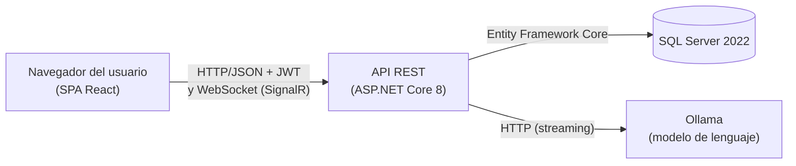
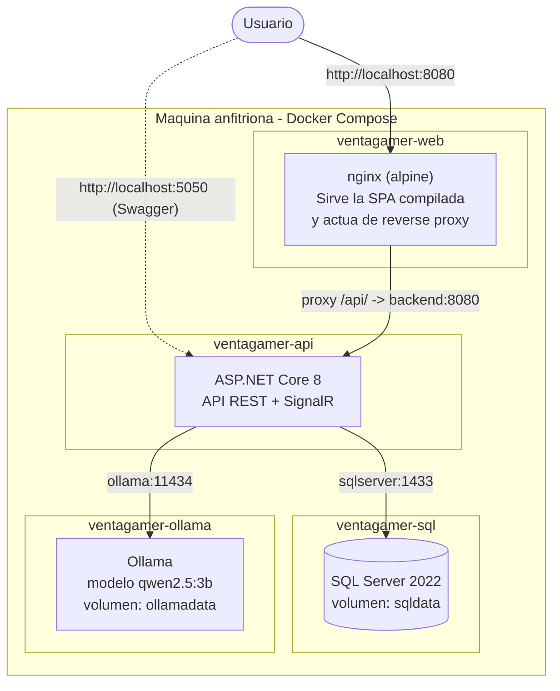
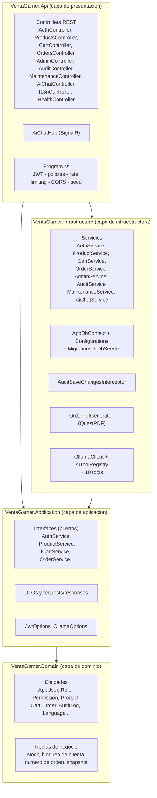
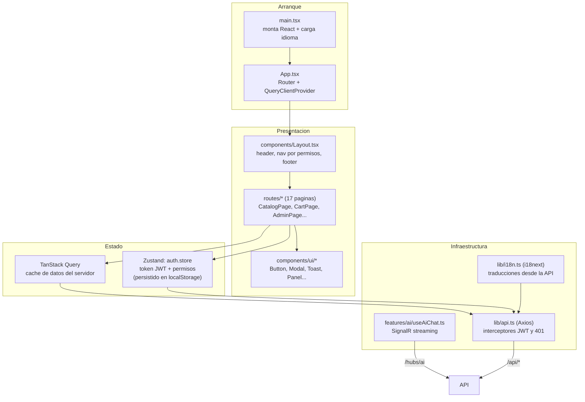

# 4. Arquitectura de la solución

[← Volver al índice](README.md)

Este documento describe la arquitectura de VentaGamer en tres niveles de detalle: primero la **vista de despliegue** (los contenedores Docker y cómo se comunican), luego la **arquitectura interna del backend** (Clean Architecture) y la **del frontend** (SPA por features), y finalmente el **stack tecnológico** con la explicación de cada componente.

## 4.1. Visión general: arquitectura cliente-servidor

VentaGamer es una aplicación **cliente-servidor** de tres capas:

- El **cliente** es una SPA (*Single Page Application*) en React que corre en el navegador. Renderiza la interfaz, maneja la navegación y consume datos por HTTP.
- El **servidor** es una API REST en ASP.NET Core que concentra toda la lógica de negocio, la seguridad y el acceso a datos.
- La **base de datos** es SQL Server, un motor relacional donde persiste toda la información.

El cliente nunca accede a la base de datos: toda interacción pasa por la API, que valida la identidad (JWT) y los permisos en cada solicitud.

### Flujo de datos de una solicitud típica

1. El usuario realiza una acción en la interfaz (por ejemplo, buscar "teclado").
2. El frontend arma la solicitud HTTP (`GET /api/products?search=teclado`) y el interceptor de Axios adjunta el token JWT en el encabezado `Authorization`.
3. La API valida el token, verifica los permisos requeridos por el endpoint (políticas de autorización) y aplica el límite de solicitudes por IP.
4. El *controller* delega en un *service* de la capa de infraestructura, que consulta la base mediante Entity Framework Core (consultas parametrizadas con paginación e índices).
5. El resultado se mapea a un DTO y vuelve como JSON.
6. TanStack Query almacena la respuesta en caché en el navegador y React actualiza el DOM solo donde cambió.

## 4.2. Vista de despliegue (Docker)

Todo el sistema se ejecuta como **cuatro contenedores** orquestados por Docker Compose ([`docker-compose.yml`](../docker-compose.yml)). Los contenedores se comunican entre sí por una red interna de Docker usando sus nombres de servicio como hostname; solo los puertos indicados quedan expuestos a la máquina anfitriona.

| Contenedor | Imagen | Puerto host | Rol |
|---|---|---|---|
| `ventagamer-web` | `nginx:alpine` (build propio) | **8080** → 80 | Sirve los archivos estáticos de la SPA (HTML/CSS/JS compilados por Vite) y reenvía las llamadas `/api/` al backend. |
| `ventagamer-api` | `mcr.microsoft.com/dotnet/aspnet:8.0` (build propio) | **5050** → 8080 | API REST, autenticación, lógica de negocio, SignalR. |
| `ventagamer-sql` | `mcr.microsoft.com/mssql/server:2022-latest` | **1434** → 1433 | Base de datos relacional. Persiste en el volumen `sqldata`. |
| `ventagamer-ollama` | `ollama/ollama:latest` | **11434** → 11434 | Motor de inferencia del modelo de lenguaje para el chatbot. Persiste los modelos en el volumen `ollamadata`. |

Detalles relevantes de la orquestación:

- **Dependencias con healthcheck:** el backend no arranca hasta que SQL Server y Ollama respondan sus verificaciones de salud, evitando errores de conexión en el arranque.
- **Builds multi-etapa:** tanto el backend ([`backend/Dockerfile`](../backend/Dockerfile)) como el frontend ([`frontend/Dockerfile`](../frontend/Dockerfile)) compilan en una imagen SDK y publican solo los artefactos finales en una imagen liviana de runtime.
- **Configuración por variables de entorno:** cadena de conexión, clave de firma JWT y modelo de IA se inyectan desde el archivo `.env`, sin tocar el código.
- **Migración y seed automáticos:** al arrancar, la API aplica las migraciones pendientes y puebla los datos iniciales (roles, permisos, usuarios demo, productos), dejando el sistema listo para usar.

## 4.3. Arquitectura del backend: Clean Architecture

El backend está organizado según **Clean Architecture** en cuatro proyectos con dependencias unidireccionales: las capas externas dependen de las internas y nunca al revés. El dominio no conoce la base de datos ni el framework web.

| Proyecto | Responsabilidad | Depende de |
|---|---|---|
| **VentaGamer.Domain** | Entidades de negocio y sus reglas (por ejemplo: `Product` valida que el stock no sea negativo; `AppUser` implementa el bloqueo tras 3 intentos fallidos; `Order` genera su número único). No referencia ningún framework. | — |
| **VentaGamer.Application** | Contratos (interfaces) de los servicios, DTOs de entrada/salida y opciones de configuración. Define **qué** hace el sistema sin decir **cómo**. | Domain |
| **VentaGamer.Infrastructure** | Implementaciones concretas: acceso a datos con EF Core, autenticación (PBKDF2 + JWT), generación de PDF, auditoría automática, cliente de Ollama, backups. | Application, Domain |
| **VentaGamer.Api** | Capa HTTP: controllers REST, hub de SignalR, configuración de seguridad y middleware (`Program.cs`). Traduce solicitudes HTTP en llamadas a servicios. | Application, Infrastructure |

**Beneficios concretos de esta separación:**

- Las reglas de negocio se pueden probar sin base de datos ni servidor web.
- Cambiar el motor de base de datos o el proveedor de IA afecta solo a Infrastructure.
- Los controllers son delgados: reciben, delegan y responden; la lógica vive en los servicios.

### Patrones de diseño aplicados

| Patrón | Dónde | Para qué |
|---|---|---|
| **Inyección de dependencias** | Todo el backend (`DependencyInjection.cs`) | Los controllers reciben interfaces; las implementaciones se registran en un único lugar. |
| **Repository implícito / Unit of Work** | `AppDbContext` de EF Core | El DbContext agrupa los cambios y los confirma como unidad. |
| **Interceptor** | `AuditSaveChangesInterceptor` | Audita automáticamente todo cambio en entidades sensibles sin código repetido en cada servicio. |
| **Snapshot** | `OrderItem` | Congela título y precio del producto al momento de la compra. |
| **Composite** | `RoleHierarchy` | Un rol hereda los permisos de sus roles padre (recorrido BFS al calcular permisos efectivos). |
| **Strategy / Options** | `JwtOptions`, `OllamaOptions` | Configuración tipada e intercambiable sin recompilar. |
| **Tool calling (function calling)** | `AiToolRegistry` + tools | El modelo de lenguaje invoca funciones del sistema de forma controlada y filtrada por permisos. |

## 4.4. Arquitectura del frontend: SPA por features

El frontend es una SPA en React 19 + TypeScript organizada por **funcionalidades verticales** (*feature folders*): cada dominio (auth, productos, carrito, admin, IA) agrupa su API, sus tipos y sus componentes.

Decisiones principales:

- **Estado de servidor vs. estado de sesión separados:** los datos que vienen de la API (productos, carrito, pedidos) viven en la caché de TanStack Query, que maneja recarga, invalidación y estados de carga/error. La sesión (token + usuario + permisos) vive en un único store de Zustand persistido en `localStorage`.
- **Autorización en la interfaz por permisos:** el menú y las páginas consultan `hasPermission(código)` para mostrar u ocultar opciones. Esta verificación es solo de **experiencia de usuario**: la garantía real está en el servidor, que revalida permisos en cada endpoint.
- **Cliente HTTP centralizado:** una única instancia de Axios adjunta el JWT en cada solicitud y, ante una respuesta 401 (token vencido), cierra la sesión automáticamente.
- **Tiempo real:** el chat con el asistente IA usa SignalR (WebSocket) para recibir la respuesta token a token, en lugar de esperar la respuesta completa.

## 4.5. Stack tecnológico

Tabla de referencia de todas las tecnologías utilizadas, su rol en el sistema y una breve descripción para quien no las conozca.

### Backend

| Tecnología | Versión | Rol en VentaGamer | Qué es |
|---|---|---|---|
| **.NET 8 (LTS)** | 8.0 | Plataforma de ejecución del backend. | Plataforma de desarrollo de Microsoft, multiplataforma (Windows/Linux/macOS) y de código abierto. La versión 8 es de soporte extendido. |
| **ASP.NET Core** | 8.0 | Framework de la API REST: controllers, middleware, autenticación, autorización. | Framework web de .NET para construir APIs y aplicaciones web de alto rendimiento. |
| **Entity Framework Core** | 8.0.10 | Acceso a datos: mapea las entidades C# a tablas SQL, genera las migraciones y traduce consultas LINQ a SQL. | ORM (mapeador objeto-relacional) oficial de .NET. Permite trabajar con la base de datos usando objetos en lugar de SQL manual. |
| **SQL Server 2022** | Developer | Base de datos relacional del sistema. | Motor de base de datos relacional de Microsoft; aquí corre en Linux dentro de Docker. |
| **SignalR** | 8.0.10 | Comunicación en tiempo real para el streaming del chatbot. | Librería de ASP.NET Core que abstrae WebSockets para enviar mensajes servidor→cliente al instante. |
| **JWT (JSON Web Tokens)** | — | Credencial de sesión: el login emite un token firmado que el cliente presenta en cada solicitud. | Estándar abierto (RFC 7519) de tokens autofirmados que contienen los datos y permisos del usuario. |
| **QuestPDF** | 2024.10.1 | Generación de los comprobantes de compra en PDF. | Librería .NET de código abierto para componer documentos PDF mediante código C#. |
| **Swagger / Swashbuckle** | 6.6.2 | Documentación interactiva de la API (entorno de desarrollo). | Herramienta que genera una interfaz web para explorar y probar los endpoints. |

### Frontend

| Tecnología | Versión | Rol en VentaGamer | Qué es |
|---|---|---|---|
| **React** | 19.2 | Construcción de la interfaz: componentes, estado y actualización eficiente del DOM. | Librería de JavaScript para construir interfaces mediante componentes declarativos. |
| **TypeScript** | 6.0 | Lenguaje del frontend: agrega tipos estáticos a JavaScript. | Superconjunto de JavaScript de Microsoft que detecta errores de tipos en tiempo de compilación. |
| **Vite** | 8.0 | Servidor de desarrollo (con recarga instantánea) y empaquetador de producción. | Herramienta de build moderna, sucesora de Webpack en la mayoría de los proyectos nuevos. |
| **Tailwind CSS** | 3.4 | Estilos y diseño responsivo mediante clases utilitarias. | Framework CSS que compone los estilos con clases pequeñas (`p-4`, `md:flex`) en lugar de hojas de estilo separadas. |
| **React Router** | 7.15 | Navegación entre páginas de la SPA sin recargar el navegador. | Librería estándar de enrutamiento del ecosistema React. |
| **TanStack Query** | 5.100 | Caché y sincronización de los datos que provienen de la API. | Librería de manejo de "estado de servidor": deduplica solicitudes, cachea respuestas y maneja estados de carga y error. |
| **Zustand** | 5.0 | Almacenamiento de la sesión (token JWT, usuario, permisos). | Librería minimalista de estado global para React. |
| **Axios** | 1.16 | Cliente HTTP con interceptores (adjuntar JWT, capturar 401). | Librería popular para realizar solicitudes HTTP desde el navegador. |
| **i18next / react-i18next** | 26 / 17 | Multi-idioma (es/en/pt) con traducciones cargadas desde la API. | Framework de internacionalización estándar del ecosistema JavaScript. |
| **@microsoft/signalr** | 10.0 | Cliente WebSocket para el streaming del chatbot. | Cliente JavaScript oficial de SignalR. |

### Infraestructura e IA

| Tecnología | Rol en VentaGamer | Qué es |
|---|---|---|
| **Docker / Docker Compose** | Empaqueta y orquesta los 4 servicios del sistema (web, API, base de datos, IA) con un solo comando. | Plataforma de contenedores: cada servicio corre aislado con sus dependencias, garantizando que funcione igual en cualquier máquina. |
| **nginx** | Sirve los archivos estáticos del frontend y reenvía las llamadas `/api/` al backend (reverse proxy). | Servidor web liviano y de alto rendimiento, estándar de facto para servir SPAs. |
| **Ollama** | Ejecuta localmente el modelo de lenguaje del chatbot (sin depender de servicios en la nube). | Herramienta de código abierto para correr modelos de lenguaje (LLM) en hardware propio, con una API HTTP compatible con tool calling. |
| **qwen2.5:3b** | Modelo de lenguaje del asistente GG. | Modelo compacto (~2 GB) de la familia Qwen 2.5, elegido por su bajo consumo de recursos y su soporte de invocación de herramientas (function calling). |

---

[← Anterior: Casos de uso](03-casos-de-uso.md) · [Volver al índice](README.md) · [Siguiente: Base de datos →](05-base-de-datos.md)
