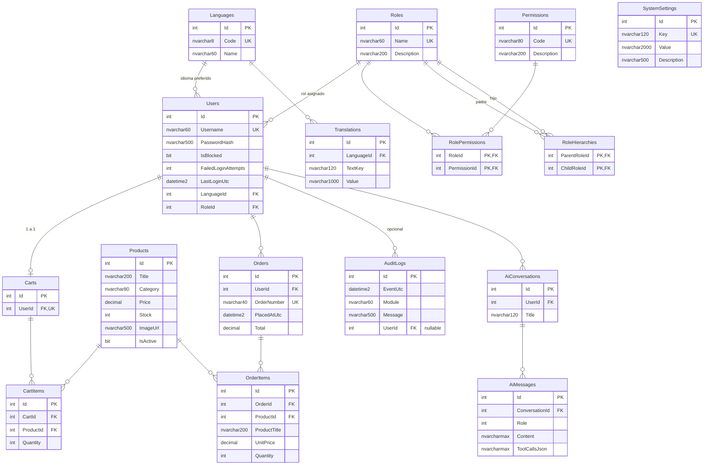
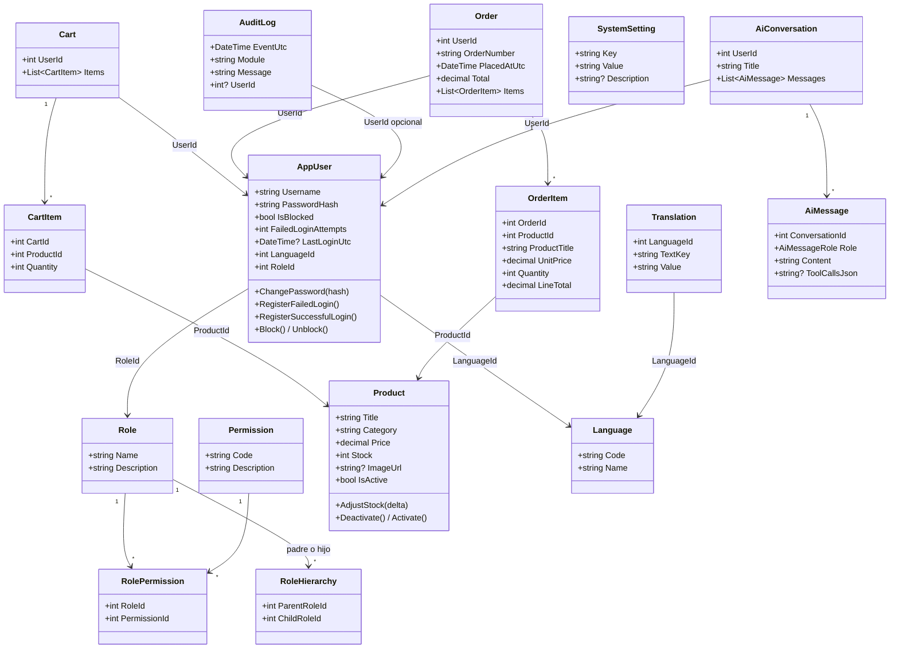

# 5. Base de datos

[← Volver al índice](README.md)

VentaGamer utiliza **SQL Server 2022** como base de datos relacional. Este documento presenta el modelo de datos completo: el diagrama de entidad-relación (DER), el diagrama de clases de las entidades del dominio, el detalle de cada tabla y la explicación de cómo se crea y puebla la base en la práctica.

## 5.1. Cómo se genera la base de datos realmente

Un punto importante para entender el proyecto: **la base de datos no se crea con un script SQL manual**, sino mediante **migraciones de Entity Framework Core** (enfoque *code-first*):

1. Las entidades se definen como clases C# en `backend/src/VentaGamer.Domain/Entities/`.
2. Las reglas de mapeo (nombres de tabla, longitudes, índices, claves foráneas, comportamiento al borrar) se definen en `backend/src/VentaGamer.Infrastructure/Persistence/Configurations/`.
3. A partir de ambas, EF Core genera **migraciones**: clases C# que describen los cambios incrementales del esquema (`backend/src/VentaGamer.Infrastructure/Persistence/Migrations/`).
4. Al arrancar, la API ejecuta `MigrateAsync()` (en `DbSeeder.SeedAsync`), que aplica las migraciones pendientes y deja el esquema actualizado. A continuación el *seeder* puebla los datos iniciales: idiomas, permisos, roles, usuarios demo, traducciones y 20 productos de ejemplo.

Las migraciones existentes son cuatro:

| Migración | Qué crea |
|---|---|
| `InitialCreate` | Languages, Permissions, Products, Roles, RoleHierarchies, RolePermissions, Users, Translations, AuditLogs |
| `AddCartsAndOrders` | Carts, CartItems, Orders, OrderItems |
| `AddAiChatTables` | AiConversations, AiMessages |
| `AddSystemSettings` | SystemSettings |

> **Sobre el script SQL de esta carpeta:** el archivo [`sql/ventagamer-demo.sql`](sql/ventagamer-demo.sql) es una **versión simplificada y demostrativa** del esquema, pensada para que el lector entienda con SQL estándar cómo son las tablas núcleo y sus relaciones. No es el mecanismo real de creación de la base (que son las migraciones descritas arriba) y omite tablas secundarias y detalles menores en favor de la claridad.

Ventajas de este enfoque frente al script manual:

- El esquema queda **versionado junto al código**: cada cambio de modelo genera una migración revisable en git.
- La base se crea y actualiza **automáticamente y de forma idéntica** en cualquier entorno (desarrollo, Docker, producción).
- Se elimina la deriva entre "lo que dice el script" y "lo que espera el código".

## 5.2. Diagrama de entidad-relación (DER)

El modelo consta de **15 tablas** organizadas en cinco áreas funcionales: seguridad (usuarios, roles, permisos), catálogo y ventas (productos, carritos, pedidos), internacionalización (idiomas, traducciones), auditoría/configuración, y chatbot IA.

> Todas las tablas incluyen además las columnas de auditoría temporal `CreatedAtUtc` y `UpdatedAtUtc` (heredadas de la clase base `EntityBase`), omitidas del diagrama por legibilidad. `RolePermissions` y `RoleHierarchies` usan claves primarias compuestas.

## 5.3. Diagrama de clases de las entidades

Vista del modelo desde el dominio (clases C#), con sus principales métodos de negocio. La mayoría de las entidades heredan de `EntityBase` (`Id`, `CreatedAtUtc`, `UpdatedAtUtc`); se omite del diagrama para no saturarlo con flechas de herencia. `RolePermission` y `RoleHierarchy` son tablas de unión y no heredan de esa clase base.

## 5.4. Detalle de las tablas

### Área de seguridad

**`Users`** — cuentas del sistema.

| Columna | Tipo | Restricción |
|---|---|---|
| Id | int IDENTITY | PK |
| Username | nvarchar(60) | UNIQUE, NOT NULL |
| PasswordHash | nvarchar(500) | NOT NULL — hash PBKDF2, nunca texto plano |
| IsBlocked | bit | bloqueo manual o por intentos fallidos |
| FailedLoginAttempts | int | se reinicia al ingresar correctamente |
| LastLoginUtc | datetime2 | nullable |
| LanguageId | int | FK → Languages (DELETE RESTRICT) |
| RoleId | int | FK → Roles (DELETE RESTRICT) |

Índices: único sobre `Username`; índices sobre `LanguageId` y `RoleId`.

**`Roles`** — perfiles de acceso (`Name` único). **`Permissions`** — catálogo de permisos atómicos (`Code` único, 12 filas sembradas).

**`RolePermissions`** — relación N:M rol↔permiso. PK compuesta (`RoleId`, `PermissionId`), borrado en cascada en ambos sentidos.

**`RoleHierarchies`** — herencia entre roles (patrón Composite). PK compuesta (`ParentRoleId`, `ChildRoleId`), DELETE RESTRICT para evitar borrados accidentales de roles con herencia.

### Área de catálogo y ventas

**`Products`** — catálogo.

| Columna | Tipo | Nota |
|---|---|---|
| Title | nvarchar(200) | indexado (búsqueda) |
| Category | nvarchar(80) | indexado (filtro) |
| Price | decimal(18,2) | |
| Stock | int | validado ≥ 0 por la entidad |
| ImageUrl | nvarchar(500) | nullable |
| IsActive | bit | **baja lógica**: los productos no se borran, se desactivan |

**`Carts` / `CartItems`** — carrito persistente. `Carts.UserId` tiene índice **único**: un usuario tiene exactamente un carrito. `CartItems` tiene índice único compuesto (`CartId`, `ProductId`): un producto aparece una sola vez por carrito (se modifica la cantidad). FK a Products con DELETE RESTRICT: no puede eliminarse físicamente un producto referenciado.

**`Orders` / `OrderItems`** — pedidos confirmados. `OrderNumber` nvarchar(40) único (formato `VG-{fecha}-{sufijo}`); índices sobre `PlacedAtUtc` y `UserId` para consultas por fecha y por cliente. `OrderItems` guarda `ProductTitle` y `UnitPrice` **copiados al momento de la compra** (snapshot): el historial no cambia si luego se modifica el catálogo.

### Área de internacionalización

**`Languages`** — idiomas disponibles (`Code` único: `es`, `en`, `pt`). **`Translations`** — pares clave/valor por idioma, con índice único compuesto (`LanguageId`, `TextKey`). El frontend descarga el diccionario del idioma activo desde la API.

### Área de auditoría y configuración

**`AuditLogs`** — bitácora. Indexada por `EventUtc`, `Module` y `UserId` para los filtros de consulta. `UserId` es nullable con DELETE SET NULL: si se elimina un usuario, sus eventos de auditoría se conservan (sin referencia).

**`SystemSettings`** — configuración clave/valor modificable en tiempo de ejecución (`Key` único). Se usa, por ejemplo, para la URL y el modelo del servidor de IA (`Ai:BaseUrl`, `Ai:Model`), lo que permite cambiarlos desde la pantalla de administración sin reiniciar el sistema.

### Área de chatbot

**`AiConversations`** — conversaciones por usuario (borrado en cascada). **`AiMessages`** — mensajes de cada conversación con su rol (usuario / asistente / herramienta / sistema), contenido y, si corresponde, el JSON de las herramientas invocadas; índice compuesto (`ConversationId`, `CreatedAtUtc`) para recuperar el historial en orden.

## 5.5. Consultas eficientes y volúmenes de datos

El diseño contempla el crecimiento del volumen de datos con tres mecanismos:

1. **Índices dirigidos a las consultas reales.** Cada filtro de la aplicación tiene su índice de respaldo: búsqueda de productos (`Title`, `Category`, `IsActive`), pedidos por cliente y por fecha (`UserId`, `PlacedAtUtc`), bitácora por fecha/módulo/usuario, y unicidad garantizada por índices únicos (`Username`, `OrderNumber`, carrito por usuario).
2. **Paginación en el servidor.** Los listados (catálogo, pedidos, bitácora) nunca devuelven tablas completas: la API recibe `page` y `pageSize` y resuelve con `Skip/Take`, devolviendo también el total para que el cliente arme la paginación. Así, el costo de cada consulta se mantiene acotado aunque la tabla crezca.
3. **Consultas de solo lectura optimizadas.** Las consultas que no modifican datos usan `AsNoTracking()` de EF Core, evitando el costo de seguimiento de cambios.

La **simulación de volúmenes** se realiza mediante el seeder (20 productos en 9 categorías, 5 usuarios con roles distintos, traducciones en 3 idiomas) y crece orgánicamente con el uso: cada compra genera pedidos e ítems, cada operación administrativa genera filas de bitácora, y cada conversación con el chatbot persiste sus mensajes.

## 5.6. Integridad referencial: resumen de políticas de borrado

| Relación | Política | Justificación |
|---|---|---|
| Users → Roles / Languages | RESTRICT | No puede eliminarse un rol o idioma con usuarios asignados. |
| CartItems / OrderItems → Products | RESTRICT | Protege el historial: un producto referenciado no se borra físicamente (se usa baja lógica). |
| Carts → Users, CartItems → Carts | CASCADE | El carrito y sus ítems no tienen valor sin el usuario. |
| OrderItems → Orders | CASCADE | Los ítems pertenecen al pedido. |
| Orders → Users | RESTRICT | Los pedidos son registros contables: no deben desaparecer en cascada. |
| AuditLogs → Users | SET NULL | La bitácora se conserva aunque el usuario se elimine. |
| AiConversations → Users, AiMessages → AiConversations | CASCADE | Las conversaciones son datos personales del usuario. |

---

[← Anterior: Arquitectura](04-arquitectura.md) · [Volver al índice](README.md) · [Siguiente: APIs →](06-apis.md)
