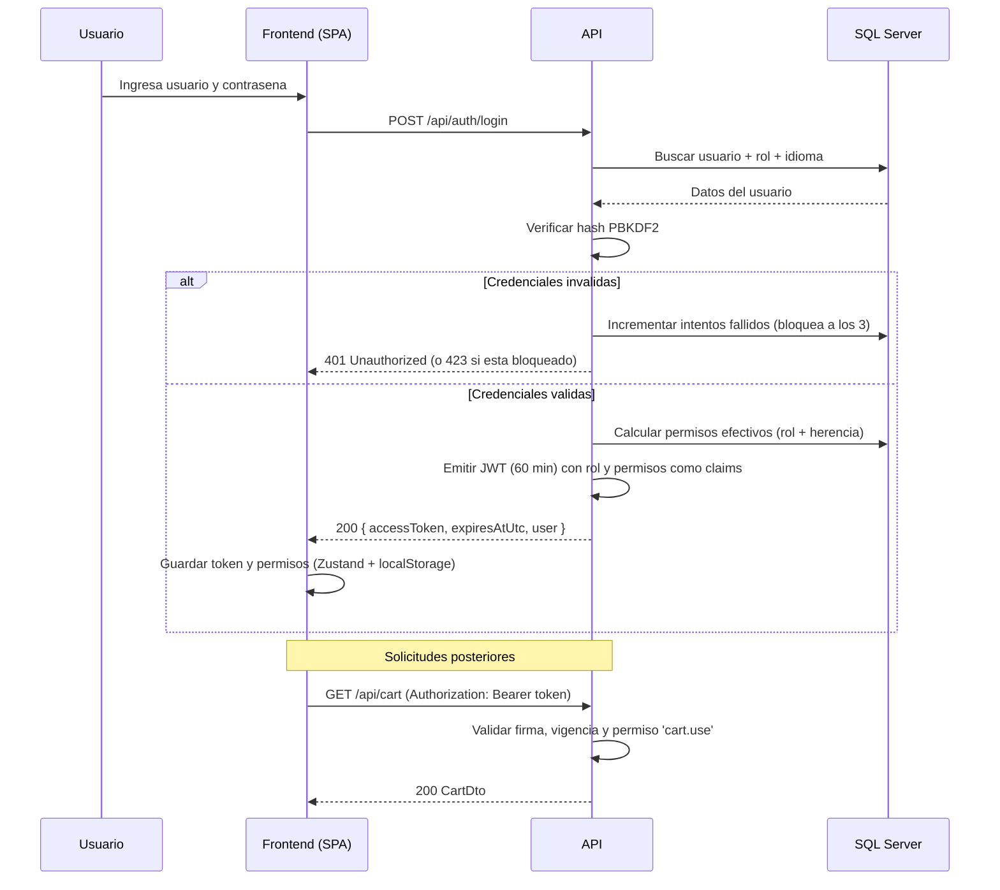
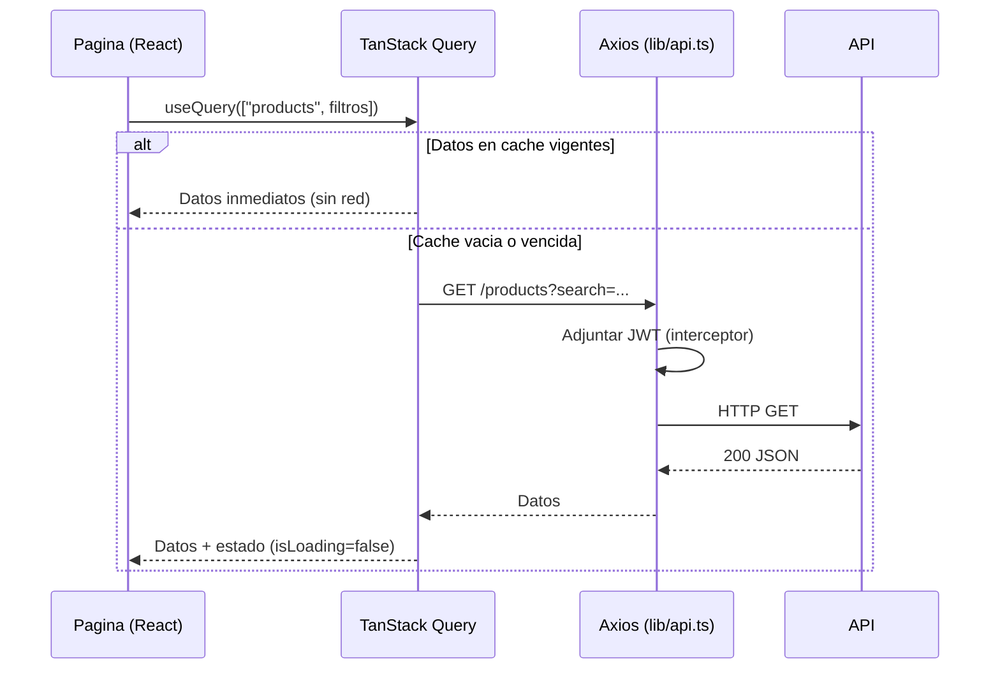

# 6. APIs

[← Volver al índice](README.md)

Toda la funcionalidad de VentaGamer se expone a través de una **API REST** propia, desarrollada en ASP.NET Core, que el frontend consume mediante HTTP/JSON. A esto se suman dos integraciones adicionales: un canal **WebSocket (SignalR)** para el streaming del chatbot y el consumo de la **API HTTP de Ollama** desde el backend para la inferencia del modelo de lenguaje.

## 6.1. Convenciones generales

- **Base:** todas las rutas cuelgan de `/api`. En desarrollo el backend escucha en `http://localhost:5050`; en Docker, nginx reenvía `/api/` al contenedor del backend.
- **Formato:** solicitudes y respuestas en JSON (`Content-Type: application/json`).
- **Autenticación:** los endpoints protegidos exigen el encabezado `Authorization: Bearer {token JWT}`.
- **Autorización:** además del token, muchos endpoints exigen un **permiso** puntual (columna "Autorización" en las tablas siguientes). El servidor valida el permiso en cada solicitud mediante políticas; no confía en lo que la interfaz muestre u oculte.
- **Exploración:** en entorno de desarrollo, Swagger UI está disponible en `http://localhost:5050/swagger` para probar los endpoints de forma interactiva.

## 6.2. Autenticación: flujo JWT

El sistema usa **JSON Web Tokens**: al iniciar sesión, el servidor emite un token firmado (HMAC-SHA256) que contiene la identidad del usuario, su rol y **todos sus permisos efectivos** como claims. El cliente lo guarda y lo presenta en cada solicitud; el servidor lo valida sin necesidad de consultar la base en cada acceso.

Detalles de seguridad del flujo:

- Contraseñas almacenadas con **PBKDF2** (hasher de ASP.NET Identity, con salt individual).
- **Bloqueo automático** de la cuenta al tercer intento fallido consecutivo (HTTP 423).
- Token con vigencia de **60 minutos**; al expirar, el interceptor del frontend detecta el 401 y cierra la sesión.
- Los endpoints de login y registro tienen un límite de **5 solicitudes por minuto por IP** contra fuerza bruta.

## 6.3. Referencia de endpoints

### Autenticación — `/api/auth` (`AuthController`)

| Método | Ruta | Autorización | Descripción |
|---|---|---|---|
| POST | `/api/auth/login` | Anónimo | Inicia sesión. Devuelve token JWT, expiración y datos del usuario. Errores: 401 (credenciales), 423 (cuenta bloqueada), 429 (límite de intentos). |
| POST | `/api/auth/register` | Anónimo | Registra un usuario nuevo (rol Cliente). Error 409 si el nombre ya existe. |
| GET | `/api/auth/me` | Autenticado | Devuelve el perfil del usuario del token. |

### Catálogo — `/api/products` (`ProductsController`)

| Método | Ruta | Autorización | Descripción |
|---|---|---|---|
| GET | `/api/products` | Anónimo | Listado paginado. Parámetros: `page`, `pageSize`, `search` (texto), `category`. Devuelve ítems + total. |
| GET | `/api/products/{id}` | Anónimo | Detalle de un producto (404 si no existe). |
| GET | `/api/products/categories` | Anónimo | Lista de categorías activas. |
| POST | `/api/products` | `products.write` | Alta de producto. |
| PUT | `/api/products/{id}` | `products.write` | Modificación. |
| DELETE | `/api/products/{id}` | `products.write` | Baja **lógica** (desactiva; no borra). |

### Carrito — `/api/cart` (`CartController`, todo requiere `cart.use`)

| Método | Ruta | Descripción |
|---|---|---|
| GET | `/api/cart` | Carrito del usuario (se crea al primer uso). |
| POST | `/api/cart/items` | Agrega un producto (`productId`, `quantity`); valida stock. |
| PUT | `/api/cart/items/{id}` | Cambia la cantidad de un ítem. |
| DELETE | `/api/cart/items/{id}` | Quita un ítem. |
| DELETE | `/api/cart` | Vacía el carrito. |

### Pedidos — `/api/orders` (`OrdersController`, requiere autenticación)

| Método | Ruta | Autorización | Descripción |
|---|---|---|---|
| POST | `/api/orders/checkout` | `cart.use` | **Transaccional:** valida stock, lo descuenta, crea el pedido y vacía el carrito. Ante cualquier falla revierte todo. |
| GET | `/api/orders/mine` | Autenticado | Pedidos del usuario actual. |
| GET | `/api/orders` | `orders.read.all` | Todos los pedidos (filtro opcional `username`). |
| GET | `/api/orders/{id}` | Dueño o `orders.read.all` | Detalle de un pedido. |
| GET | `/api/orders/{id}/pdf` | Dueño o `orders.read.all` | Comprobante PDF generado con QuestPDF. |

### Administración — `/api/admin` (`AdminController`)

| Método | Ruta | Autorización | Descripción |
|---|---|---|---|
| GET | `/api/admin/roles` | `roles.read` | Roles con permisos y roles padre. |
| GET | `/api/admin/permissions` | `roles.read` | Catálogo de los 12 permisos. |
| POST | `/api/admin/roles` | `roles.write` | Crear rol (permisos + herencia). |
| PUT | `/api/admin/roles/{id}` | `roles.write` | Modificar rol. |
| DELETE | `/api/admin/roles/{id}` | `roles.write` | Eliminar rol (409 si tiene usuarios). |
| GET | `/api/admin/users` | `users.register` | Listar usuarios. |
| PUT | `/api/admin/users/{id}/blocked` | `users.register` | Bloquear / desbloquear. |
| PUT | `/api/admin/users/{id}/role` | `users.register` | Cambiar rol de un usuario. |

### Bitácora — `/api/audit` (`AuditController`)

| Método | Ruta | Autorización | Descripción |
|---|---|---|---|
| GET | `/api/audit` | `audit.read` | Bitácora paginada; filtros: `username`, `module`, `from`, `to`. |

### Mantenimiento — `/api/maintenance` (`MaintenanceController`)

| Método | Ruta | Autorización | Descripción |
|---|---|---|---|
| POST | `/api/maintenance/backup` | `backup.manage` | Genera un backup `.bak` comprimido de la base. |
| GET | `/api/maintenance/backups` | `backup.manage` | Historial de backups (desde el catálogo `msdb`). |
| GET | `/api/maintenance/integrity` | `integrity.check` | Verificación de integridad HMAC-SHA256 de usuarios y pedidos. |

### Chatbot IA — `/api/ai` (`AiChatController`, requiere autenticación)

| Método | Ruta | Autorización | Descripción |
|---|---|---|---|
| GET | `/api/ai/status` | Autenticado | ¿Está Ollama disponible? |
| GET | `/api/ai/conversations` | Autenticado | Conversaciones del usuario. |
| POST | `/api/ai/conversations` | Autenticado | Nueva conversación. |
| GET | `/api/ai/conversations/{id}/messages` | Autenticado (dueño) | Historial de mensajes. |
| DELETE | `/api/ai/conversations/{id}` | Autenticado (dueño) | Eliminar conversación. |
| GET | `/api/ai/config` | `config.read` | Configuración del asistente (URL, modelo, modelos disponibles). |
| PUT | `/api/ai/config` | `roles.write` | Cambiar URL/modelo **en tiempo de ejecución** (persiste en `SystemSettings`). |
| POST | `/api/ai/config/test` | `config.read` | Probar conexión contra una URL sin guardarla. |

### Internacionalización — `/api/i18n` (`I18nController`)

| Método | Ruta | Autorización | Descripción |
|---|---|---|---|
| GET | `/api/i18n/languages` | Anónimo | Idiomas disponibles. |
| GET | `/api/i18n/translations/{lang}` | Anónimo | Diccionario clave→valor del idioma. |

### Salud — `/api/health` (`HealthController`)

| Método | Ruta | Autorización | Descripción |
|---|---|---|---|
| GET | `/api/health` | Anónimo | Estado del servicio y conectividad con la base de datos. |

## 6.4. Canal en tiempo real: SignalR

Para el chatbot, la respuesta del modelo se transmite **token a token** por un hub de SignalR (WebSocket), lo que permite mostrar el texto a medida que se genera en lugar de esperar la respuesta completa:

- **Hub:** `/hubs/ai` (`AiChatHub`). Autenticación por JWT enviado como parámetro de conexión (`access_token`), como exige WebSocket.
- **Cliente → servidor:** `SendMessage(conversationId, text)`.
- **Servidor → cliente:** eventos `AiStreamStart` (inicio), `AiStreamToken` (cada fragmento de texto), `AiStreamEnd` (fin) y `AiStreamError` (por ejemplo, si Ollama está fuera de línea).
- **Protección propia:** máximo 10 mensajes por minuto por conexión.

## 6.5. Manejo de errores

La API comunica los errores mediante códigos HTTP estándar y mensajes JSON; el frontend los normaliza con un helper (`toApiError`) y los muestra de forma amigable.

| Código | Cuándo ocurre | Cómo lo maneja el frontend |
|---|---|---|
| 400 | Datos inválidos (por ejemplo, URL de Ollama mal formada). | Mensaje de validación junto al formulario. |
| 401 | Sin token, token vencido o credenciales incorrectas. | El interceptor de Axios cierra la sesión automáticamente y redirige al login. |
| 403 | Token válido pero sin el permiso requerido. | Pantalla de "sin permisos" (estado vacío). |
| 404 | Recurso inexistente (producto, pedido, conversación). | Mensaje de "no encontrado". |
| 409 | Conflicto: usuario ya existente, rol con usuarios asignados. | Mensaje específico del conflicto. |
| 423 | Cuenta bloqueada por intentos fallidos. | Mensaje indicando contactar al administrador. |
| 429 | Límite de solicitudes excedido (rate limiting). | Mensaje de "demasiados intentos, aguarde". |
| 500 | Error interno (por ejemplo, falla de la base). | Mensaje genérico con opción de reintentar. |

**Rate limiting (protección contra abuso):** configurado en `Program.cs` con el middleware nativo de ASP.NET Core:

- **Global:** 60 solicitudes por minuto por dirección IP.
- **Endpoints de autenticación:** 5 solicitudes por minuto por IP (login y registro).
- Al excederse, el servidor responde **429 Too Many Requests**.

**Resiliencia hacia la base de datos:** la conexión de EF Core usa `EnableRetryOnFailure` (hasta 3 reintentos automáticos ante fallas transitorias), y el checkout usa la estrategia de ejecución de EF combinada con transacciones explícitas.

## 6.6. Cómo consume la API el frontend

El frontend nunca usa `fetch` disperso por el código: centraliza el acceso en dos piezas.

**1. Cliente HTTP único (Axios)** — `frontend/src/lib/api.ts`:

- Instancia con `baseURL: "/api"` (en desarrollo, Vite hace proxy a `localhost:5050`; en Docker, nginx hace proxy al backend).
- Interceptor de solicitud: adjunta `Authorization: Bearer {token}` leyendo el store de sesión.
- Interceptor de respuesta: ante un 401 con sesión activa, ejecuta el logout automático.

**2. TanStack Query** — en cada página:

- Las **consultas** (`useQuery`) cachean los datos con una clave (por ejemplo `["products", page, search]`), evitan solicitudes duplicadas y exponen estados de carga y error listos para la interfaz.
- Las **mutaciones** (`useMutation`) ejecutan las escrituras (agregar al carrito, checkout, ABM) e **invalidan** las consultas afectadas para que la interfaz se actualice sola.

## 6.7. API externa consumida: Ollama

Además de exponer su propia API, el backend **consume una API externa**: la de **Ollama**, el servidor local de modelos de lenguaje.

- `GET {ollama}/api/tags` — verificación de disponibilidad y listado de modelos instalados.
- `POST {ollama}/api/chat` — inferencia en modo streaming, con soporte de *tool calling* (el modelo puede pedir la ejecución de funciones del sistema).

La URL y el modelo se leen en cada solicitud desde la tabla `SystemSettings` (con valores por defecto en la configuración), por lo que pueden cambiarse desde la pantalla de administración **sin reiniciar** el sistema. El detalle completo está en [09 — Chatbot con IA](09-chatbot-ia.md).

---

[← Anterior: Base de datos](05-base-de-datos.md) · [Volver al índice](README.md) · [Siguiente: Frontend →](07-frontend.md)
