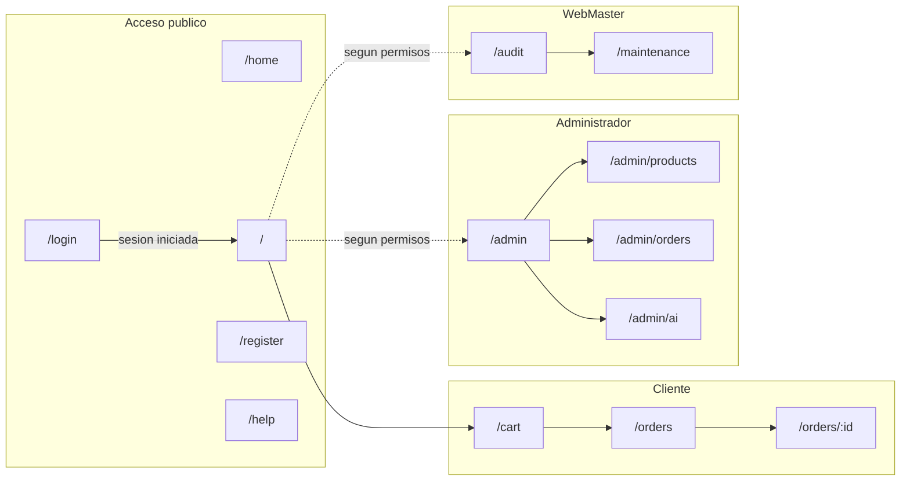

# 7. Frontend: interfaz, DOM, responsive y formularios

[← Volver al índice](README.md)

El frontend de VentaGamer es una **SPA (Single Page Application)** construida con React 19, TypeScript, Vite y Tailwind CSS. Este documento describe la estructura de páginas y navegación, cómo se manipula el DOM, el diseño responsivo, los formularios con sus validaciones, el sistema visual y el soporte multi-idioma.

## 7.1. Páginas y navegación

La aplicación tiene **17 páginas** gestionadas por React Router. La navegación es **interna**: al cambiar de página no se recarga el navegador; el router intercambia los componentes dentro del layout común (encabezado con menú, contenido, pie).

| Ruta | Página | Acceso |
|---|---|---|
| `/` | Catálogo de productos (página principal) | Público |
| `/home` | Landing de presentación | Público |
| `/login` | Inicio de sesión | Público |
| `/register` | Registro de cuenta | Público |
| `/password-reset` | Recuperación de contraseña (demostrativa) | Público |
| `/help` | Ayuda y preguntas frecuentes | Público |
| `/cart` | Carrito y checkout | Sesión + `cart.use` |
| `/orders` | Mis compras | Sesión |
| `/orders/:id` | Detalle de pedido + descarga PDF | Sesión (dueño o admin) |
| `/admin` | Gestión de roles y usuarios | `roles.read` o `users.register` |
| `/admin/products` | ABM de productos | `products.write` |
| `/admin/orders` | Todas las compras | `orders.read.all` |
| `/admin/ai` | Configuración del asistente IA | `config.read` (edición: `roles.write`) |
| `/audit` | Bitácora de auditoría | `audit.read` |
| `/maintenance` | Backups e integridad | `backup.manage` o `integrity.check` |
| `/config` | Preferencias del usuario | Sesión |
| `*` | Página 404 | Público |

El **menú se construye dinámicamente según los permisos** del usuario: un cliente ve Catálogo, Carrito y Mis compras; un administrador ve además Administración; un WebMaster ve Bitácora y Mantenimiento. La verificación en la interfaz es de usabilidad — la garantía real la da el servidor, que revalida permisos en cada endpoint (ver [06 — APIs](06-apis.md)).



## 7.2. Manipulación del DOM

La consigna exige manipulación del DOM (crear, modificar y eliminar elementos, y responder a eventos). En VentaGamer esto se realiza a través de **React**, que es hoy la forma profesional estándar de manipular el DOM: en lugar de llamar manualmente a `document.createElement` o `element.remove()`, se **declara** cómo debe verse la interfaz para cada estado, y React calcula y aplica las operaciones de DOM mínimas necesarias (mediante su DOM virtual).

Ejemplos concretos en la aplicación:

| Interacción | Qué ocurre en el DOM | Dónde |
|---|---|---|
| Escribir en el buscador del catálogo | Se **eliminan** las tarjetas de producto que no coinciden y se **crean** las nuevas, sin recargar la página. | `CatalogPage.tsx` |
| Agregar un producto al carrito | El contador del carrito en el encabezado se **modifica** al instante; aparece un aviso (toast) que luego se **elimina** solo. | `Layout.tsx`, `Toast` |
| Cambiar cantidades en el carrito | Cada botón +/− dispara un evento que **actualiza** los nodos del total y de la línea. | `CartPage.tsx` |
| Abrir el detalle de una imagen | Se **crea** un visor superpuesto (lightbox) y se **destruye** al presionar Escape o hacer clic afuera. | `Lightbox` |
| Abrir el formulario de producto | Se **monta** un modal con el formulario; al guardar o cancelar se **desmonta**. | `AdminProductsPage.tsx`, `Modal` |
| Conversar con el asistente IA | Cada token recibido por WebSocket **agrega texto** al último mensaje en pantalla, en tiempo real. | `AiChatWidget.tsx` |
| Abrir el menú en un móvil | El botón hamburguesa **crea/oculta** el panel de navegación. | `Layout.tsx` |

El **manejo de eventos** (clic, envío de formularios, teclado, cambio de inputs) se realiza con los manejadores sintéticos de React (`onClick`, `onSubmit`, `onChange`, `onKeyDown`), que por debajo registran los listeners nativos del navegador.

## 7.3. Diseño responsivo

El diseño se adapta a móviles, tablets y escritorio usando las **utilidades responsivas de Tailwind CSS**, que aplican estilos según puntos de corte (*breakpoints*): `sm` (≥640 px), `md` (≥768 px), `lg` (≥1024 px), etc. El enfoque es *mobile-first*: los estilos base apuntan a pantallas chicas y los prefijos agregan variantes para pantallas mayores.

Aplicaciones concretas:

- **Navegación:** en escritorio se muestra la barra completa de enlaces (`hidden lg:flex`); en pantallas menores se reemplaza por un **menú hamburguesa** que despliega las mismas opciones en un panel vertical.
- **Grillas adaptativas:** el catálogo muestra 1 columna en móvil, 2 en tablet y 3-4 en escritorio (`grid-cols-1 sm:grid-cols-2 lg:grid-cols-3`); las pantallas de administración y el carrito reorganizan sus columnas de igual forma.
- **Elementos condicionales:** componentes secundarios (como el selector de idioma) se ocultan en pantallas muy chicas para priorizar el contenido.
- **Tipografía y espaciado fluidos:** los tamaños de fuente y márgenes escalan por breakpoint para mantener la legibilidad.

## 7.4. Formularios y validaciones

Los formularios validan **en el cliente** (respuesta inmediata al usuario) y **siempre también en el servidor** (garantía real; ver [08 — Calidad](08-calidad-y-normativa.md)).

| Formulario | Validaciones en el cliente |
|---|---|
| **Registro** | Usuario obligatorio; contraseña de al menos 8 caracteres; confirmación coincidente; indicador de fortaleza de la contraseña; aceptación de términos obligatoria. |
| **Inicio de sesión** | Campos obligatorios; mensajes diferenciados para credenciales inválidas (401), cuenta bloqueada (423) y exceso de intentos (429). |
| **Alta/edición de producto** | Título y categoría obligatorios; precio y stock numéricos no negativos. |
| **Roles** | Nombre obligatorio; selección de permisos del catálogo. |
| **Configuración IA** | La URL debe ser válida y absoluta; botón de "probar conexión" antes de guardar. |
| **Chat IA** | No permite enviar mensajes vacíos ni cuando el asistente está fuera de línea. |

Los errores del servidor se muestran junto al formulario con mensajes claros (no códigos técnicos), usando el componente `Field` (etiqueta, indicador de requerido, ayuda y error) y paneles de error.

## 7.5. Sistema de diseño (UI)

La interfaz sigue una estética **"cyber/arcade" oscura** coherente con la temática gamer:

- **Tema:** fondo oscuro (paleta `ink`), acentos neón (cian y magenta), efectos de brillo y animaciones sutiles.
- **Tipografías:** Orbitron para títulos (display), Rajdhani para texto y JetBrains Mono para datos técnicos.
- **Componentes reutilizables** (`src/components/ui/`): botones, paneles, chips, campos de formulario, modales, toasts, spinners, estados vacíos, visor de imágenes y encabezados de página/sección. Todas las pantallas se componen con estas piezas, lo que asegura consistencia visual.
- **Clases utilitarias propias** (`src/index.css`): `.panel`, `.btn-*`, `.input`, `.table-cyber`, definidas sobre Tailwind con `@layer components`.

Aspectos de accesibilidad implementados: atributo `lang="es"` en el documento, `aria-label` en botones de ícono (zoom, +/− del carrito, cerrar modal, menú móvil), cierre de modales con la tecla Escape, `aria-pressed` en conmutadores y bloqueo del scroll de fondo cuando hay un modal abierto. Las limitaciones pendientes se detallan en [08 — Calidad y normativa](08-calidad-y-normativa.md).

## 7.6. Multi-idioma (i18n)

El sistema soporta **español, inglés y portugués** con una particularidad: las traducciones **no están en archivos del frontend, sino en la base de datos** (tablas `Languages` y `Translations`), y se sirven por la API.

Funcionamiento:

1. Al iniciar, la aplicación lee el idioma preferido guardado en el navegador (`localStorage`, clave `ventagamer.lang`) o usa español por defecto.
2. Descarga el diccionario del idioma desde `GET /api/i18n/translations/{código}` y lo registra en **i18next**.
3. Los componentes traducen con la función `t("clave")` — por ejemplo `t("nav.catalog")` → "Catálogo" / "Catalog" / "Catálogo".
4. El **selector de idioma** del encabezado permite cambiar en caliente: descarga el nuevo diccionario y re-renderiza la interfaz sin recargar.
5. En el registro, el idioma elegido se guarda como preferencia del usuario en su perfil.

Ventaja de este diseño: agregar o corregir traducciones no requiere recompilar ni redesplegar el frontend; basta modificar filas en la base de datos.

## 7.7. Estructura del código fuente

```
frontend/src/
├── main.tsx              # Punto de entrada: monta React y carga el idioma
├── App.tsx               # Definición de rutas + proveedor de TanStack Query
├── index.css             # Tailwind + clases del sistema de diseño
├── lib/                  # Infraestructura transversal
│   ├── api.ts            #   Cliente Axios con interceptores JWT
│   ├── i18n.ts           #   Configuración de i18next (traducciones desde la API)
│   └── productImage.ts   #   Imágenes de respaldo por categoría
├── components/
│   ├── Layout.tsx        # Encabezado, menú por permisos, pie, widget IA
│   ├── LanguageSwitcher.tsx
│   └── ui/               # Biblioteca de componentes reutilizables
├── features/             # Lógica por dominio (API + tipos + componentes)
│   ├── auth/             #   Sesión: store Zustand, llamadas de login/registro
│   ├── products/         #   API y tipos del catálogo
│   ├── cart/             #   API y tipos de carrito/pedidos
│   ├── admin/            #   API de roles/usuarios
│   └── ai/               #   Chat IA: API, hook SignalR y widget
└── routes/               # 17 páginas (una por ruta)
```

---

[← Anterior: APIs](06-apis.md) · [Volver al índice](README.md) · [Siguiente: Calidad y normativa →](08-calidad-y-normativa.md)
