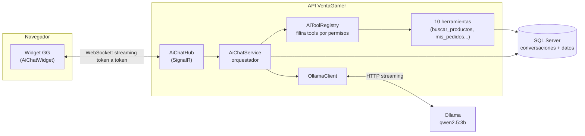
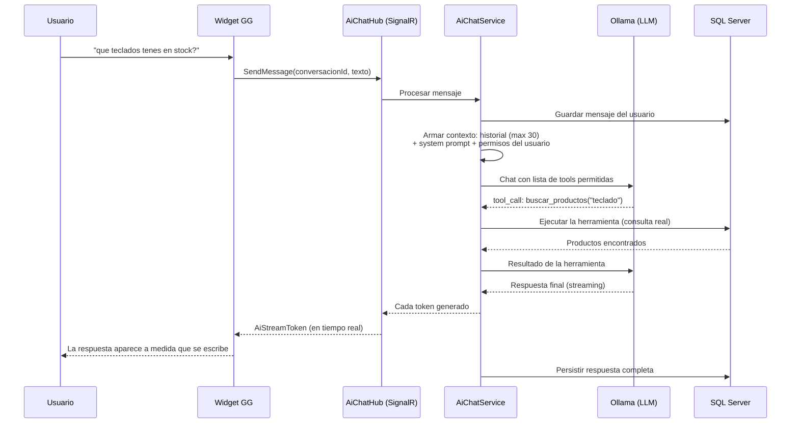

# 9. Chatbot con IA: el asistente "GG"

[← Volver al índice](README.md)

VentaGamer implementa la funcionalidad opcional de nivel avanzado de la consigna: un **chatbot integrado con inteligencia artificial**. El asistente se llama **GG** (*Game Guide*) y permite a los usuarios consultar el sistema en lenguaje natural: buscar productos, verificar stock, revisar pedidos y —para administradores— consultar indicadores de ventas.

Lo distintivo de la implementación es que el asistente **no inventa datos**: consulta la base de datos real mediante un mecanismo de *tool calling* (invocación de herramientas), y solo puede acceder a la información que los **permisos del usuario** que consulta le habilitan.

## 9.1. Arquitectura general

El motor de lenguaje es **Ollama**, un servidor de modelos de IA que corre **localmente** (como contenedor Docker propio), sin depender de servicios en la nube: ninguna conversación sale de la infraestructura del sistema. El modelo configurado por defecto es **qwen2.5:3b**, un modelo compacto (~2 GB) con soporte de invocación de herramientas.

Componentes (todos en `backend/src/VentaGamer.Infrastructure/Ai/` salvo indicación):

| Componente | Rol |
|---|---|
| `AiChatWidget` (frontend) | Ventana de chat flotante, disponible en toda la aplicación para usuarios autenticados. Renderiza las respuestas con formato (Markdown). |
| `AiChatHub` (API, SignalR) | Canal WebSocket: recibe el mensaje del usuario y transmite la respuesta token a token. |
| `AiChatService` | Orquestador: arma el contexto, ejecuta el ciclo de tool calling y persiste la conversación. |
| `AiToolRegistry` | Decide qué herramientas están disponibles **para este usuario**, según sus permisos. |
| `OllamaClient` | Cliente HTTP hacia Ollama; lee URL y modelo desde la configuración en BD en cada solicitud. |
| Tablas `AiConversations` / `AiMessages` | Persistencia del historial: las conversaciones se pueden retomar. |

## 9.2. El ciclo de tool calling

El modelo de lenguaje no accede a la base de datos directamente. En cambio, el sistema le describe un conjunto de **herramientas** (funciones con nombre, descripción y parámetros) y el modelo decide cuándo invocarlas. El backend ejecuta la herramienta, le devuelve el resultado y el modelo continúa hasta poder responder.

Salvaguardas del ciclo:

- **Máximo 8 rondas** de herramientas por mensaje (evita bucles infinitos).
- **Historial acotado** a los últimos 30 mensajes (controla el tamaño del contexto).
- **Throttling:** máximo 10 mensajes por minuto por conexión.
- Si Ollama está fuera de línea, el widget lo indica claramente y deshabilita el envío.

## 9.3. Las herramientas y sus permisos

Las 10 herramientas disponibles están en `backend/src/VentaGamer.Infrastructure/Ai/Tools/`. El registro (`AiToolRegistry`) **filtra según los permisos del usuario**: el modelo ni siquiera "ve" las herramientas que el usuario no puede usar, por lo que es imposible que un cliente consulte datos administrativos a través del chat.

| Herramienta | Qué hace | Permiso requerido |
|---|---|---|
| `buscar_productos` | Busca en el catálogo por título o categoría (máximo 10 resultados). | Ninguno (catálogo público) |
| `consultar_stock` | Stock actual de un producto por su ID. | Ninguno |
| `listar_categorias` | Categorías de productos activas. | Ninguno |
| `listar_capacidades` | Meta-herramienta: informa al modelo qué puede hacer para este usuario. | Ninguno |
| `mis_pedidos` | Pedidos del usuario que consulta. | `orders.read.own` |
| `detalle_pedido` | Detalle de un pedido (propio; o de cualquiera con permiso ampliado). | `orders.read.own` / `orders.read.all` |
| `kpis_admin` | Indicadores globales: ventas, facturación, usuarios. | `orders.read.all` |
| `top_productos_vendidos` | Ranking de productos más vendidos. | `orders.read.all` |
| `pedidos_recientes` | Últimos pedidos del sistema. | `orders.read.all` |

Ejemplos de interacción:

- **Cliente:** "¿tenés auriculares por menos de $120?" → el modelo invoca `buscar_productos("auriculares")`, filtra por precio y responde con los productos reales, incluyendo IDs y stock.
- **Cliente:** "¿cuándo hice mi última compra?" → `mis_pedidos` → responde con el número de orden y la fecha reales.
- **Administrador:** "¿cuál fue el producto más vendido este mes?" → `top_productos_vendidos` → responde con el ranking real.

## 9.4. Personalidad y reglas del asistente

El comportamiento del asistente se define en un *system prompt* (en `OllamaOptions`, `backend/src/VentaGamer.Application/Ai/OllamaOptions.cs`) que establece:

- **Identidad:** es "GG", asistente de VentaGamer, con tono cordial y temática gamer moderada; responde en español.
- **Regla de veracidad:** nunca inventa precios, stock ni fechas — todo dato debe provenir de una herramienta.
- **Filosofía "nunca un no plano":** antes de responder "no puedo", intenta otras herramientas o combinaciones; si el usuario no tiene permisos para algo, se lo explica indicando qué permiso falta.
- **Formato:** usa Markdown (negritas para precios y nombres, tablas para comparaciones) e incluye los IDs de productos para que el usuario pueda seguir preguntando.

## 9.5. Configuración en tiempo de ejecución

La pantalla `/admin/ai` permite administrar el asistente **sin reiniciar el sistema**:

- **URL del servidor Ollama:** puede apuntar al contenedor local o a otra máquina de la red.
- **Modelo:** seleccionable entre los instalados en Ollama (por ejemplo, cambiar a un modelo más grande si el hardware lo permite).
- **Probar conexión** antes de guardar.

Los valores se persisten en la tabla `SystemSettings` (claves `Ai:BaseUrl` y `Ai:Model`) y el cliente los relee en cada solicitud, con la configuración estática como respaldo. El estado (en línea / fuera de línea) y los modelos disponibles se muestran en la misma pantalla.

## 9.6. Privacidad

Las conversaciones se procesan **íntegramente en infraestructura propia**: Ollama corre como contenedor local y no se envía ningún dato a servicios de IA de terceros. Cada usuario solo accede a sus propias conversaciones, puede eliminarlas cuando lo desee (borrado en cascada de sus mensajes) y el asistente opera bajo los mismos permisos que el usuario tiene en el resto del sistema.

---

[← Anterior: Calidad y normativa](08-calidad-y-normativa.md) · [Volver al índice](README.md) · [Siguiente: Backup y recuperación →](10-backup-y-recuperacion.md)
